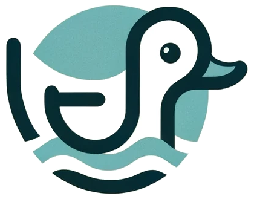

</img>

# Lista de tareas
Completa esta lista para llevar a Quacker al nivel que se merece

### TODO
- [ ] Aislar el entorno de ejecución de Python y exportar sus dependencias
- [ ] Crear imagen de Docker
- [ ] Levantar con contenedor de Mongo
  - [ ] Versión inicial sin variables de entorno
  - [ ] Usando variables de entorno
- [ ] Versión con Docker-Compose (¡usando volúmenes! Los Quacks son las píldoras de información más valiosas de Internet)

### En progreso
- [ ] DAO para conectar con Mongo. __Nota:__ *esto ya está, pero falta decidir cómo definimos el paso de la URI de conexión*

### Hecho ✓
- [x] Crear la mejor red social del mundo para compartir noticias e ideas